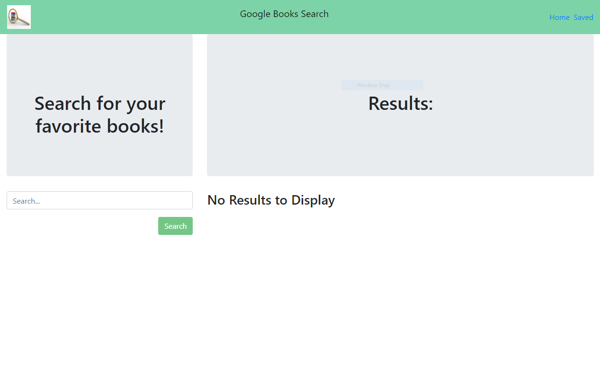
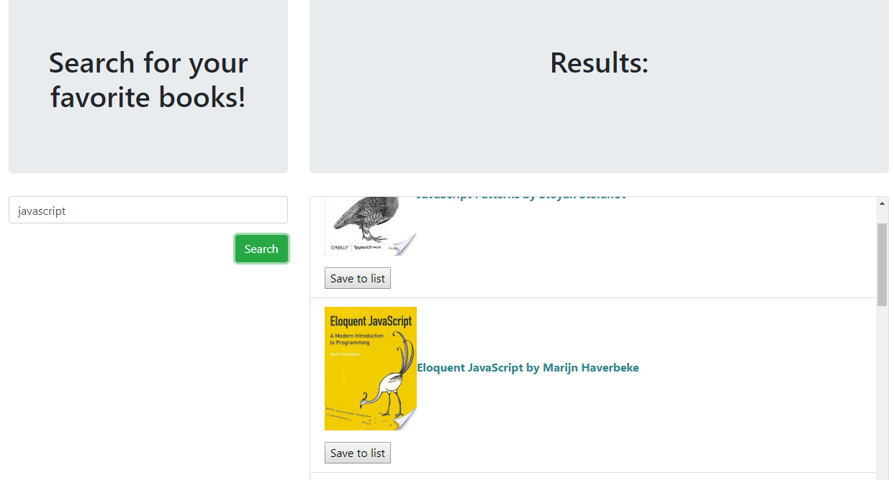

# google-books-list
Search for your favorite books and save them to a list for later reference.  

Deployed on heroku here:  
https://google-books-list.herokuapp.com/  

  
  
  

### Technologies used:  
* Mongo DB with Mongoose.js
* Express.js
* React.js
* Node.js
* Google Books API
* Bootstrap 4

### Future development:
1. Revise styling and layout
2. Add features to saved books - thumbnails, summaries, etc.
3. User authentication
4. Expand media - movies, music?  

Built as an exercise in MERN Stack development
